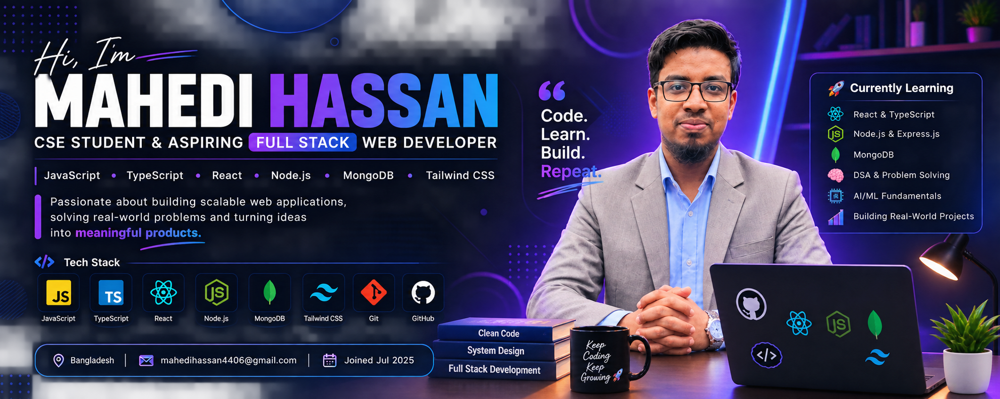

# 👋 Hi, I'm Mahedi Hassan

### 💻 CSE Student | Aspiring Full Stack Web Developer

  
  

  

---

## 👨‍💻 About Me

I'm a **Computer Science and Engineering student** with a strong interest in
**Web Development, Software Engineering, DSA, and AI/ML**.

I enjoy building real-world applications, solving programming problems,
learning new technologies, and turning ideas into useful projects.

- 🎓 CSE Student
- 💻 Aspiring Full Stack Web Developer
- 🌱 Currently learning **React, TypeScript, Node.js, PostgreSQL, DSA & AI/ML**
- 🧠 Interested in **Software Engineering & AI/ML**
- 🚀 Passionate about building real-world projects
- ⚡ Fun fact: **I enjoy turning ideas into real-world projects**

---

## 🚀 Full-Stack Development

I'm currently developing my skills across the complete web development stack.

### Frontend
`HTML` `CSS` `JavaScript` `React` `Tailwind CSS` `TypeScript`

### Backend
`Node.js` `Express.js`

### Database
`MongoDB` `MySQL` `PostgreSQL`

### Programming
`C` `C++` `JavaScript` `TypeScript`

### Other
`Git` `GitHub` `VS Code` `Postman` `Docker`

---

## 🚀 Featured Projects

<table>
<tr>

<td width="50%">

<h3 align="center">🧠 BrainBoost</h3>

A quiz-based learning platform designed to make
learning interactive and engaging.

</td>

<td width="50%">

<h3 align="center">🏥 Hospital Management System</h3>

A web-based hospital management system for managing
patients, doctors and hospital information.

</td>

</tr>
</table>

---

---

# 🎯 Current Goals

| 🚀 Goal | Status |
|--------|--------|
| 💻 Build Full Stack Web Applications | 🔄 In Progress |
| 🧠 Improve DSA & Problem Solving | 🔄 In Progress |
| ⚛️ Master React & TypeScript | 🔄 In Progress |
| 🟢 Learn Node.js & Express.js | 🔄 In Progress |
| 🐘 Learn PostgreSQL | 🔄 In Progress |
| 🤖 Explore AI/ML | 🔄 In Progress |
| 🚀 Build Real-World Projects | 🔄 In Progress |

---

# 📚 Currently Learning

- ⚛️ Advanced React
- 🟦 TypeScript
- 🟢 Node.js & Express.js
- 🗄️ MongoDB & PostgreSQL
- 🐍 Python
- 🧠 Data Structures & Algorithms
- 🤖 AI/ML Fundamentals
- 🔧 Git & GitHub
- 🌐 Full Stack Web Development

---

# 🛠️ Tech Stack

### 💻 Languages

### 🎨 Frontend

### ⚙️ Backend

### 🗄️ Database

### 🔧 Tools & Technologies

---

# 📊 GitHub Stats

---

# 📈 Contribution Activity

---

# 🤝 Connect With Me

---

# 💼 Open to Opportunities

I'm interested in:

- 💻 Full Stack Development
- 🌐 Web Development
- ⚛️ React Development
- 🟢 Node.js Development
- 🧠 Machine Learning
- 🤖 AI Engineering
- 🔧 Software Engineering
- 🚀 Open Source Contributions

If you have an interesting project, collaboration opportunity,
or internship opportunity, feel free to reach out!

---

# 🌟 Let's Build Something Amazing Together

💙 Thanks for visiting my GitHub profile!

 

**Keep Coding • Keep Learning • Keep Building 🚀**

 

⭐ If you find my projects useful, consider giving them a star!

---

### 💙 Made with ❤️ by Mahedi Hassan

